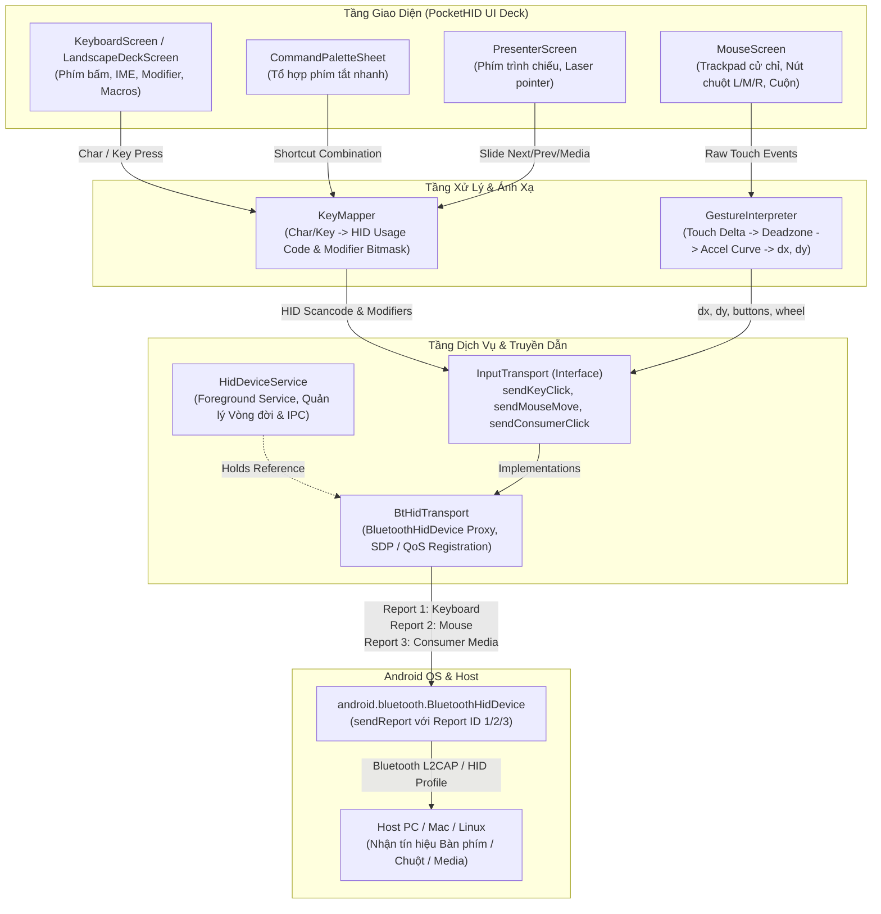

# Wave 0 Code Map — PocketHID Architecture & Data Flow

Báo cáo khảo sát mã nguồn PocketHID phục vụ phân tích kiến trúc Wave 0.
Dữ liệu trích xuất từ MCP `code-review-graph` (Graph version SHA `689a5f3`, 27 files, 180 nodes, 4,741 edges, 24 flows, 8 communities).

---

## 1. Tổng Quan Hệ Thống & Entrypoints

### 1.1 Điểm vào ứng dụng (Entrypoints)
- **UI Entrypoint:** `dev.aleian.pockethid.MainActivity` (Flow #1, #2)
  - Khởi tạo Compose Root (`PocketHIDApp`), kiểm tra hỗ trợ phần cứng Bluetooth HID Profile (`BtHidTransport.checkSupport`), kiểm tra quyền runtime (API 31+), khởi động và bind tới `HidDeviceService`.
- **Background Service Entrypoint:** `dev.aleian.pockethid.service.HidDeviceService` (Flow #6, #20)
  - Chạy dạng Android Foreground Service với loại `connectedDevice` (`FOREGROUND_SERVICE_CONNECTED_DEVICE`), duy trì vòng đời `BtHidTransport` và trạng thái kết nối Bluetooth HID khi app thu nhỏ hoặc màn hình tắt.

---

## 2. Phân Rã Module & Trách Nhiệm (Communities)

| Module / Package | Trách nhiệm chính | Thành phần cốt lõi | Community MCP |
| :--- | :--- | :--- | :--- |
| **`dev.aleian.pockethid`** | Vòng đời ứng dụng, cấp quyền, điều hướng chính | `MainActivity.kt`, `PocketHIDApp`, `PermissionScreen.kt`, `UnsupportedScreen.kt` | Community 1 (17 nodes) |
| **`dev.aleian.pockethid.service`** | Duy trì Foreground Service, hiển thị thông báo trạng thái, IPC Binder | `HidDeviceService.kt` | Community 4 (15 nodes) |
| **`dev.aleian.pockethid.transport`** | Đăng ký Bluetooth HID Device Profile, quản lý SDP/QoS, gửi raw HID byte reports | `BtHidTransport.kt`, `InputTransport.kt` | Community 5 (32 nodes) |
| **`dev.aleian.pockethid.mapping`** | Chuyển đổi ký tự/phím sang mã HID Scancode; tính toán cử chỉ chuột/cuộn/tốc | `KeyMapper.kt`, `GestureInterpreter.kt` | Community 2 (10 nodes) |
| **`dev.aleian.pockethid.model`** | Cấu hình tham số, trạng thái kết nối máy chủ, hằng số HID Report Descriptors | `AppSettings.kt`, `SettingsRepository.kt`, `ConnectionState.kt`, `HidConstants.kt` | Community 3 & 8 (15 nodes) |
| **`dev.aleian.pockethid.ui.screens`** | Giao diện điều khiển (Command Deck), nhận tương tác người dùng | `MainScreen.kt`, `KeyboardScreen.kt`, `MouseScreen.kt`, `PresenterScreen.kt`, `LandscapeDeckScreen.kt`, `CommandPaletteSheet.kt`, `SettingsScreen.kt`, `PairingSheet.kt`, `DiagnosticsSheet.kt` | Community 7 (53 nodes) |
| **`dev.aleian.pockethid.ui.components`** | Thư viện phím, thanh kết nối, layout tái sử dụng | `DeckComponents.kt`, `ConnectionBar.kt` | Community 6 (10 nodes) |

---

## 3. Sơ Đồ Luồng Dữ Liệu (Mermaid Data Flow)

Sơ đồ thể hiện đường truyền tín hiệu từ thao tác người dùng trên UI qua tầng Mapping và Transport tới Host PC:

---

## 4. Phụ Thuộc Ngoại Vi (External Dependencies)

1. **Android Framework Bluetooth HID Device API:**
   - Yêu cầu tối thiểu Android 9.0 (API 28) hỗ trợ `BluetoothProfile.HID_DEVICE`.
   - Sử dụng các lớp nội bộ Android: `BluetoothHidDevice`, `BluetoothHidDeviceAppSdpSettings`, `BluetoothHidDeviceAppQosSettings`.
2. **Android Jetpack Compose:**
   - Compose BOM `2024.12.01`, Material3 `1.3.1`, Navigation Compose `2.8.5`.
3. **Android Platform Services:**
   - `android.os.Vibrator` / `VibratorManager` (Haptic feedback).
   - `android.content.ClipboardManager` (Safe Paste injection).

---

## 5. Vùng Chưa Có Test (Untested Areas)

- `[đã đo]` Thư mục `app/src/test` và `app/src/androidTest` hiện chưa có mã kiểm thử tự động (0 unit tests, 0 instrumentation tests).
- **Vùng rủi ro cao chưa có test bao gồm:**
  1. `KeyMapper.kt`: Các quy tắc tính toán bitmask modifier (`Shift`, `Ctrl`, `Alt`, `GUI`) và ánh xạ ký tự đặc biệt / tổ hợp phím (F1-F12, numpad, multimedia).
  2. `GestureInterpreter.kt`: Thuật toán deadzone, đường cong gia tốc (acceleration curves: Linear, Dynamic, Precision), cuộn 2 ngón và bộ lọc nhiễu jitter.
  3. `SettingsRepository.kt`: Luồng đọc/ghi `SharedPreferences` và các giá trị mặc định cấu hình.
  4. `BtHidTransport.kt`: Xử lý ngoại lệ bảo vệ khi gọi API Bluetooth lúc mất quyền hoặc thiết bị ngắt kết nối đột ngột.
