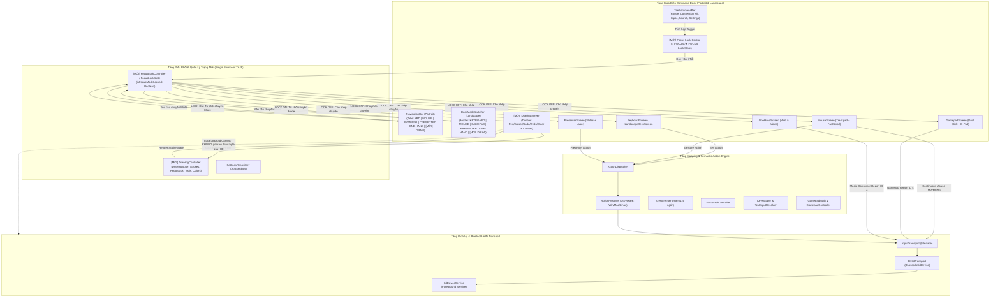

# Wave 0 Code Map — PocketHID Architecture & Data Flow

Báo cáo khảo sát mã nguồn PocketHID phục vụ phân tích kiến trúc Wave 0 (Focus Lock & Electronic Drawing Board).
Dữ liệu trích xuất từ MCP `code-review-graph` tại commit `1d2cee8` (71 files parsed, 576 nodes, 9,788 edges, 56 flows, 15 communities).

---

## 1. Tổng Quan Hệ Thống & Entrypoints

### 1.1 Điểm vào ứng dụng (Entrypoints)
- **UI Entrypoint:** `dev.aleian.pockethid.MainActivity` (Flow #25)
  - Khởi tạo Compose Root (`PocketHIDApp`), kiểm tra phần cứng Bluetooth HID Profile (`BtHidTransport.checkSupport`), kiểm tra quyền runtime (API 31+ `BLUETOOTH_CONNECT`), khởi động và bind tới `HidDeviceService`.
- **Background Service Entrypoint:** `dev.aleian.pockethid.service.HidDeviceService` (Flow #34)
  - Chạy dạng Android Foreground Service với loại `connectedDevice` (`FOREGROUND_SERVICE_CONNECTED_DEVICE`), duy trì vòng đời `BtHidTransport` và trạng thái kết nối Bluetooth HID khi app thu nhỏ hoặc màn hình tắt.
- **Navigation & Mode Entrypoints:**
  - Portrait Mode Switcher: `MainScreen.kt` (`NavigationBar` với 5 tabs: Keyboard [0], Mouse [1], Gamepad [2], Presenter [3], One-Hand [4]).
  - Landscape Mode Switcher: `LandscapeDeckScreen.kt` thông qua `DeckModeSwitcher` (`DeckComponents.kt:226`).

---

## 2. Phân Rã Module & Trách Nhiệm (15 Communities từ MCP Graph)

| Module / Package | Trách nhiệm chính | Thành phần cốt lõi | Community MCP (Node count) |
| :--- | :--- | :--- | :--- |
| **`dev.aleian.pockethid`** | Vòng đời ứng dụng, cấp quyền, cấu hình giao diện root | `MainActivity.kt`, `PocketHIDApp`, `PermissionScreen.kt`, `UnsupportedScreen.kt` | `pockethid-service` (20 nodes) |
| **`dev.aleian.pockethid.service`** | Duy trì Foreground Service, thông báo trạng thái, quản lý Service Binder IPC | `HidDeviceService.kt` | `service-service` (15 nodes) |
| **`dev.aleian.pockethid.transport`** | Đăng ký Bluetooth HID Device Profile, quản lý SDP/QoS, gửi raw HID byte reports (Keyboard, Mouse, Consumer, Gamepad) | `BtHidTransport.kt`, `InputTransport.kt`, `HidConstants.kt` | `transport-send` (45 nodes) |
| **`dev.aleian.pockethid.action`** | Semantic Action Engine: Chuẩn hóa hành động ngữ nghĩa, phân giải OS-aware (Windows/Mac/Linux), điều phối gửi input | `PocketAction.kt`, `ActionResolver.kt`, `ActionDispatcher.kt`, `ActionRegistry.kt`, `ActionExecutionPlan.kt` | `action-action` (94 nodes) & `action-action-send` (35 nodes) |
| **`dev.aleian.pockethid.mapping`** | Chuyển đổi ký tự/phím, giải mã bộ gõ IME, nhận diện cử chỉ trackpad đa ngón, vùng cuộn nhanh mép phải | `KeyMapper.kt`, `TextInputResolver.kt`, `GestureInterpreter.kt`, `FastScrollController.kt` | `mapping-touch` (33 nodes) & `mapping-finger` (39 nodes) |
| **`dev.aleian.pockethid.gamepad`** | Bộ điều khiển Gamepad chuẩn USB HID: deadzone, curves, trigger mapping, neutral latch telemetry | `GamepadController.kt`, `GamepadMath.kt`, `GamepadDiagnosticsHub.kt`, `GamepadState.kt` | `gamepad-trigger` (28 nodes) & `gamepad-report` (27 nodes) |
| **`dev.aleian.pockethid.power`** | Quản lý đánh thức màn hình (Keep Awake) theo cài đặt người dùng | `ScreenWakeManager.kt` | `power-screen` (8 nodes) |
| **`dev.aleian.pockethid.model`** | Cấu hình cài đặt, trạng thái kết nối Bluetooth, Settings repository | `AppSettings.kt`, `SettingsRepository.kt`, `ConnectionState.kt` | `model-settings` (16 nodes) |
| **`dev.aleian.pockethid.ui.screens`** | Tầng giao diện Command Deck điều khiển PC và hiển thị trạng thái | `MainScreen.kt`, `KeyboardScreen.kt`, `MouseScreen.kt`, `GamepadScreen.kt`, `PresenterScreen.kt`, `OneHandScreen.kt`, `LandscapeDeckScreen.kt`, `SettingsScreen.kt`, `SettingsSections.kt`, `CommandPaletteSheet.kt`, `PairingSheet.kt`, `DiagnosticsSheet.kt` | `screens-key` (131 nodes) |
| **`dev.aleian.pockethid.ui.components`** | Reusable UI components: Phím ảo, thanh điều hướng, dải kết nối, custom IME view | `DeckComponents.kt`, `ConnectionBar.kt`, `MultiTouchTrackpad.kt`, `PocketImeInputView.kt`, `DedicatedNumberRow.kt` | Thuộc `screens-key` & `action-action` |

---

## 3. Sơ Đồ Luồng Dữ Liệu Hiện Tại & Điểm Tích Hợp Focus Lock / Drawing Board

Sơ đồ Mermaid thể hiện luồng xử lý tín hiệu hiện tại và vị trí cắm chốt (anchors) của 2 tính năng mới:

---

## 4. Phụ Thuộc Ngoại Vi (External Dependencies)

1. **Android Framework & Bluetooth Profile:**
   - Min SDK: Android 9.0 (API 28), Target SDK: Android 14 (API 34).
   - Quyền: `BLUETOOTH_CONNECT`, `BLUETOOTH_ADVERTISE`, `FOREGROUND_SERVICE_CONNECTED_DEVICE`.
   - Android Bluetooth API: `BluetoothHidDevice`, `BluetoothProfile.ServiceListener`.
2. **Android Jetpack Compose & UI Framework:**
   - Compose BOM: `2024.12.01`, Material3: `1.3.1`.
   - Drawing Surface Canvas: `androidx.compose.foundation.Canvas`, `androidx.compose.ui.graphics.Path`, `androidx.compose.ui.graphics.drawscope.DrawScope`.
   - Insets & Cutouts: `androidx.compose.foundation.layout.WindowInsets`, `displayCutout`, `statusBarsPadding`, `navigationBarsPadding`.
3. **Hardware Services:**
   - `android.os.Vibrator` / `VibratorManager`: Phục vụ haptic phản hồi tinh tế (tool selection, clear confirmation).

---

## 5. Vùng Chưa Có Test & Điểm Yếu Cần Rào Đo

1. **Vùng điều hướng Mode & Khóa Chế Độ (Chưa có test):**
   - Hiện tại `MainScreen.kt` và `LandscapeDeckScreen.kt` chưa có bất kỳ unit test nào kiểm tra máy trạng thái điều hướng chuyển tab khi có `Focus Lock`.
   - Cần bổ sung test case riêng (`FocusLockTest.kt`) kiểm tra: Focus OFF $\rightarrow$ chuyển mode bình thường; Focus ON $\rightarrow$ chặn chuyển mode; Focus ON $\rightarrow$ controls con bên trong mode vẫn gửi HID bình thường; Mở khóa Focus $\rightarrow$ phục hồi chuyển mode.
2. **Vùng Drawing State & History (Chưa có mã và chưa có test):**
   - Drawing logic là tính năng hoàn toàn mới.
   - Cần viết trọn vẹn bộ Unit Test cho `DrawingController` và `DrawingState` trước khi gắn vào UI: Start stroke, append points, finish stroke, undo/redo, clear with confirm, multi-touch single-finger tracking, hit-test eraser, bounded history limit.
3. **Các Hotspots và God-Functions trong UI Screens:**
   - `KeyboardScreen.kt` (848 dòng Composable), `CommandPaletteSheet.kt` (682 dòng), `OneHandScreen.kt` (543 dòng), `MultiTouchTrackpad.kt` (604 dòng).
   - *RÀO cảnh báo:* Việc thêm `DRAW` mode và `Focus Lock` tuyệt đối **không được** sửa đổi vào bên trong logic của các Composable khổng lồ này, mà chỉ can thiệp vào tầng điều hướng (`DeckModeSwitcher`, `TopCommandBar`, `MainScreen.kt`, `LandscapeDeckScreen.kt`).
