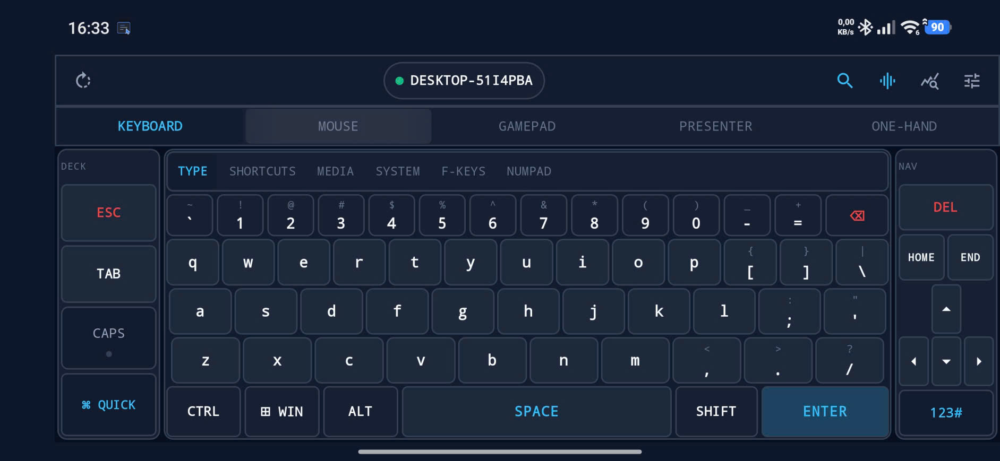
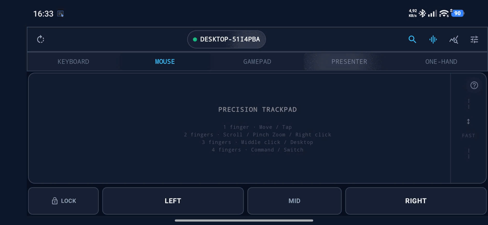
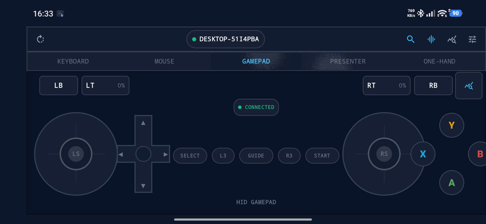
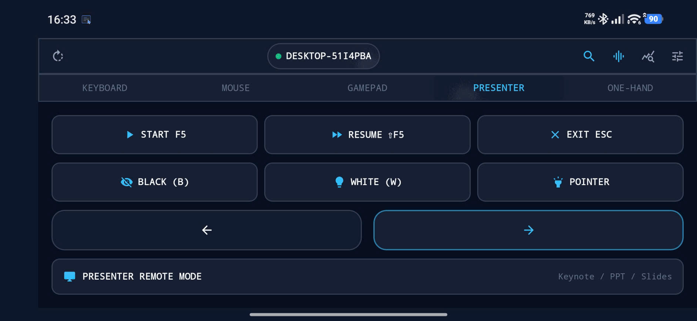
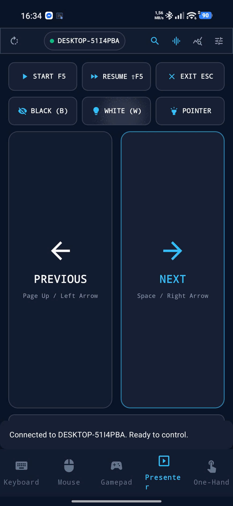
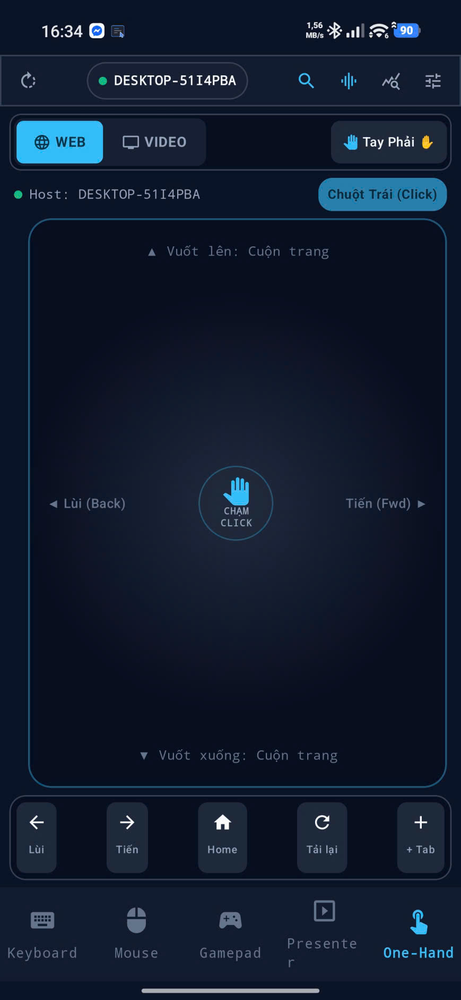
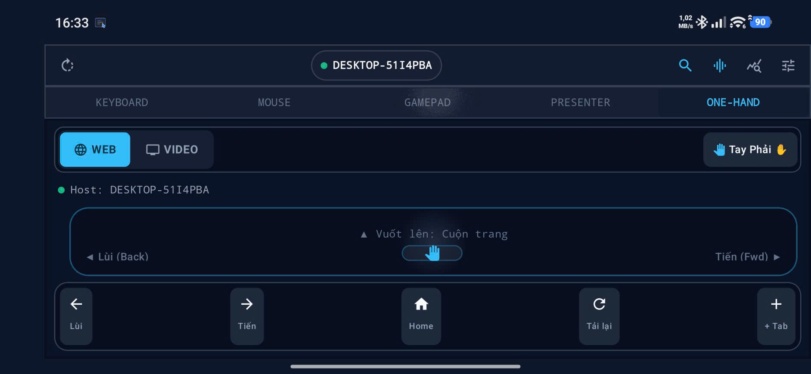

# 📱 PocketHID — Android Universal Bluetooth HID Controller & Command Deck

<p align="center">
  
  
  
  
  
</p>

<p align="center">
  
</p>

---

## 💡 Giới thiệu (Overview)

**PocketHID** biến smartphone Android của bạn thành một bộ điều khiển **Universal Bluetooth HID Controller & Command Deck** đa năng 5-trong-1 độ trễ cực thấp:

1. **⌨️ Smart Landscape Command Deck & Typing Engine**: Bàn phím cơ ảo công thái học 3 vùng với hàng phím số chuyên dụng, phím Windows độc lập, hệ thống ký tự shifted hai tầng và 6 layer chức năng chuyên sâu.
2. **🖱️ Precision Multi-Touch Trackpad**: Bàn rê chuột cảm ứng đa điểm hỗ trợ cử chỉ 1–4 ngón, dải cuộn nhanh siêu tốc mép phải (Fast Scroll Zone) và cụm nút chuột vật lý độc lập.
3. **🎮 Driverless Bluetooth HID Gamepad**: Tay cầm chơi game chuẩn USB HID nhận diện trực tiếp trong Windows `joy.cpl` mà không cần cài thêm driver hay phần mềm trung gian.
4. **📽️ Presenter & Laser Remote**: Điều khiển thuyết trình chuyên nghiệp hỗ trợ cả 2 chiều cầm ngang/dọc, tích hợp các phím chức năng F5, Esc, màn hình đen/trắng và con trỏ.
5. **📱 One-Hand Web & Video Touch Remote**: Điều khiển lướt web và xem video chỉ bằng một ngón cái, tùy biến tay thuận Trái/Phải thông minh.

---

### 🌟 Điểm Độc Bản: Chuẩn Phần Cứng Bluetooth HID — Không Cần Server / Client!

PocketHID đăng ký trực tiếp **Bluetooth HID Device Profile** tiêu chuẩn của hệ điều hành Android (Composite Device: Keyboard + Mouse + Consumer Media + Gamepad):

- ❌ **Không cài phần mềm máy tính (No .exe / No daemon / No companion app).**
- ❌ **Không phụ thuộc vào mạng Wi-Fi hay cổng mạng nội bộ.**
- ✅ **Hoạt động trực tiếp tại màn hình đăng nhập Windows/macOS, màn hình khóa và ngay cả trong BIOS/UEFI.**
- ✅ **Chuẩn Plug & Play 100% driverless** trên Windows, macOS, Linux, ChromeOS, Android TV và Raspberry Pi.

---

## 🕹️ 5 Chế Độ Điều Khiển Cốt Lõi (Core Modes)

---

### 1. ⌨️ Smart Landscape Command Deck & Typing Engine

Giao diện bàn phím ngang công thái học được tính toán tỉ lệ vàng theo tầm với ngón cái (Left Thumb 11% — QWERTY Keybed 78% — Right Nav 11%):

<p align="center">
  
</p>

- **Hàng phím số cố định (Dedicated Number Row):** Nằm trực tiếp phía trên hàng chữ QWERTY (` ` ` `1` `2` `3` `4` `5` `6` `7` `8` `9` `0` `-` `=`), căn chỉnh hoàn hảo không bị che khuất hay lẹm viền.
- **Ký tự hai tầng (Dual Shifted Legends):** Hiển thị rõ nét cả ký tự chính và ký tự Shift phụ (`~` `!` `@` `#` `$` `%` `^` `&` `*` `(` `)` `_` `+`).
- **Phím Windows chuyên dụng (`⊞ WIN`):** Nằm tại hàng bottom theo đúng chuẩn bàn phím máy tính thực tế, hỗ trợ kích hoạt Start Menu và các tổ hợp phím hệ thống (`Win+D`, `Win+Tab`, `Win+E`).
- **Cụm phím điều hướng & soạn thảo riêng biệt (Right Nav Zone):** `DEL`, `HOME`, `END`, và cụm 4 phím mũi tên `↑` `←` `↓` `→` kích thước lớn, thao tác chính xác không chạm nhầm notch/camera.
- **Hệ thống phím bổ trợ thông minh (Left Deck Zone):** `ESC`, `TAB`, `CAPS` (tích hợp đèn LED báo trạng thái On/Off trực quan), và phím mở nhanh `QUICK` Action Deck.
- **6 Layer chuyển đổi linh hoạt:**
  - `TYPE`: Bàn phím QWERTY đầy đủ.
  - `SHORTCUTS`: Macro một chạm cho Clipboard, Window Management, Terminal (`^C`, `^V`, `^Z`, `^L`).
  - `MEDIA`: Bảng điều khiển đa phương tiện Consumer Report ID 3 (Volume Up/Down, Mute, Play/Pause, Next, Prev).
  - `SYSTEM`: Quản lý cửa sổ Snap (Left/Right/Maximize), Desktop ảo, Show Desktop (`Win+D`), Task View.
  - `F-KEYS`: Dãy phím chức năng từ `F1` đến `F12` kèm `PrtSc`, `PgUp`, `PgDn`.
  - `NUMPAD`: Bàn phím số kế toán tiêu chuẩn.

---

### 2. 🖱️ Precision Multi-Touch Trackpad & Right Edge Fast Scroll Zone

Mặt cảm ứng đa điểm diện tích cực lớn, phản hồi tức thì với thuật toán chống xung đột cử chỉ (**Gesture Priority Lock**):

<p align="center">
  
</p>

| Cử chỉ | Thao tác | Tác vụ điều khiển |
| :--- | :--- | :--- |
| **1 ngón** | **Di chuyển (Move)** | Rê chuột mượt mà (Đường cong gia tốc phi tuyến + Deadzone chống rung) |
| | **Chạm (Tap)** | Nhấp chuột trái (Left Click) |
| | **Chạm đúp (Double Tap)** | Nhấp đúp chuột trái (Double Left Click) |
| | **Chạm + Giữ (Tap + Hold)** | Khóa chuột trái để kéo thả (Drag Mode) |
| **2 ngón** | **Rê dọc / Rê ngang** | Cuộn trang dọc & cuộn trang ngang siêu mượt (hỗ trợ Natural Scroll) |
| | **Chạm (Tap)** | Nhấp chuột phải (Right Click) |
| | **Pinch Out (Bung 2 ngón)** | **Zoom In** (Phóng to màn hình qua `Ctrl + Wheel Up` / `Cmd + Plus`) |
| | **Pinch In (Chụm 2 ngón)** | **Zoom Out** (Thu nhỏ màn hình qua `Ctrl + Wheel Down` / `Cmd + Minus`) |
| **3 ngón** | **Chạm (Tap)** | Nhấp chuột giữa (Middle Click) |
| | **Vuốt Trái / Phải** | Chuyển đổi Desktop ảo: `Ctrl + Win + ◀` / `Ctrl + Win + ▶` |
| | **Vuốt Lên (Swipe Up)** | Mở Task View / Quản lý tác vụ: `Win + Tab` |
| | **Vuốt Xuống (Swipe Down)** | Thu nhỏ toàn bộ về màn hình chính: `Win + D` (Show Desktop) |
| **4 ngón** | **Chạm (Tap)** | Mở nhanh Command Deck / Quick Actions Palette |
| | **Vuốt Trái / Phải** | Chuyển đổi ứng dụng đang chạy: `Alt + Tab` / `Alt + Shift + Tab` |
| | **Vuốt Lên / Xuống** | Task Overview / Show Desktop |

- **⚡ Right Edge Fast Scroll Zone:** Dải cuộn nhanh dọc mép phải màn hình với gia tốc 2.5x–5.0x, cuộn nhanh qua hàng nghìn dòng code hay tài liệu dài mà không chiếm vùng rê chuột chính.
- **Cụm phím chuột vật lý chuyên biệt:** Các nút `LOCK`, `LEFT`, `MID`, `RIGHT` nằm độc lập ở đáy màn hình, cho phép giữ nút chuột bằng một tay và rê vị trí chuột bằng tay còn lại để kéo thả cửa sổ cực kỳ chuẩn xác.

---

### 3. 🎮 Driverless Bluetooth HID Gamepad (Chuẩn Windows `joy.cpl`)

PocketHID xuất ra bộ báo cáo tay cầm tiêu chuẩn quốc tế (**Report ID 4, 13 bytes**) qua Bluetooth SDP Subclass `0xC8`:

<p align="center">
  
</p>

- **Tương thích Windows Native:** Windows tự động nhận diện PocketHID ngay lập tức trong bảng điều khiển **Game Controllers (`joy.cpl`)** và **Device Manager** dưới dạng thiết bị DirectInput tiêu chuẩn mà không cần cài thêm phần mềm hay driver ảo.
- **11 Nút bấm kỹ thuật số (Digital Buttons):** `A`, `B`, `X`, `Y`, `LB`, `RB`, `SELECT/BACK`, `START`, `GUIDE/HOME`, `L3` (nhấn cần trái), `R3` (nhấn cần phải).
- **8-Way D-Pad (Hat Switch):** Điều hướng 8 hướng chuẩn USB HID Generic Desktop Hat Switch (`1..8`, neutral `0`).
- **4 Trục Analog (Dual Thumbsticks):**
  - **Left Stick (X, Y):** Đóng gói trong Pointer Physical Collection, dải giá trị chuẩn `-32768 .. +32767`.
  - **Right Stick (Z, Rz):** Đóng gói trong Pointer Physical Collection, dải giá trị chuẩn `-32768 .. +32767`.
  - Hỗ trợ tùy biến Deadzone, thuật toán phản hồi (Linear, Precision, Aggressive) và Sensitivity.
- **2 Cò Analog (Analog Triggers):** `LT` và `RT` với thanh đo áp lực trực quan theo phần trăm (`0% .. 100%`, giá trị tuyến tính `0 .. 255`).
- **Cơ chế chống kẹt phím (Anti-Stuck Protection):** Tự động phát báo cáo trung lập (`Neutral Report`) khi nhấc ngón tay, chuyển màn hình hoặc ngắt kết nối Bluetooth.

---

### 4. 📽️ Presenter & Laser Remote (Landscape & Portrait)

Chuyên dụng cho các buổi báo cáo, hội thảo, giảng dạy trên PowerPoint, Google Slides, Keynote và trình đọc PDF:

<p align="center">
  
  
</p>

- **Vùng chạm điều hướng cực lớn (`PREVIOUS` / `NEXT`):** Cho phép người thuyết trình bấm chuyển slide tự tin mà không cần nhìn vào màn hình điện thoại.
- **Phím chức năng thuyết trình nhanh:**
  - `▶ START F5`: Bắt đầu trình chiếu từ slide đầu tiên.
  - `⏩ RESUME ⇧F5`: Tiếp tục trình chiếu từ slide hiện tại (`Shift + F5`).
  - `✕ EXIT ESC`: Thoát chế độ trình chiếu.
  - `👁️‍🗨️ BLACK (B)`: Bật/tắt màn hình đen để hướng sự chú ý về diễn giả.
  - `💡 WHITE (W)`: Bật/tắt màn hình trắng khi cần ghi chú lên bảng chiếu.
  - `🔦 POINTER`: Kích hoạt con trỏ laser ảo trên slide.
- **Linh hoạt 2 tư thế cầm:** Tự động điều chỉnh layout tối ưu khi xoay ngang (Landscape) hoặc cầm đứng một tay (Portrait).

---

### 5. 📱 One-Hand Web & Video Touch Remote

Được thiết kế tỉ mỉ để người dùng lướt web hoặc xem video YouTube / Netflix thư giãn từ xa chỉ bằng một ngón cái:

<p align="center">
  
  
</p>

- **Tùy chọn tay thuận Trái / Phải (`Tay Phải ✋` / `Tay Trái 🤚`):** Đảo ngược bố cục công thái học theo tay cầm của người dùng.
- **🌐 Chế độ lướt Web (Web Mode):**
  - **Mặt cảm ứng trung tâm:** Vuốt lên / vuốt xuống để cuộn trang; vuốt trái để lùi trang (`Back`); vuốt phải để tiến trang (`Forward`).
  - **Chạm đơn (Tap):** Nhấp chuột trái để mở liên kết.
  - **Thanh công cụ nhanh:** `Lùi`, `Tiến`, `Home`, `Tải lại (F5)`, `+ Tab mới`.
- **🎬 Chế độ xem Video (Video Mode):**
  - Chạm đơn để Phát / Tạm dừng video (`Play/Pause`).
  - Vuốt dọc để tăng/giảm âm lượng hệ thống với chu kỳ xung 85ms chuẩn HID.
  - Vuốt ngang để tua nhanh 10 giây hoặc lùi 10 giây.
  - Thanh công cụ nhanh: `Bài trước`, `Lùi 10s`, `Phát/Dừng`, `Tiến 10s`, `Bài tiếp`, `Tắt tiếng (Mute)`.

---

## 🔍 Kiến Trúc Kỹ Thuật & Khả Năng Tương Thích Host

### 1. Báo Cáo HID Composite Đa Tầng (Multi-Report Architecture)

PocketHID sử dụng bộ mô tả thiết bị tổng hợp (**Combo Report Descriptor**) được tối ưu hóa cho Windows HID Stack và macOS IOHIDFamily:

```text
┌────────────────────────────────────────────────────────┐
│             Bluetooth HID SDP Subclass 0xC8            │
├────────────┬─────────────────────────────┬─────────────┤
│ Report ID  │ Chức năng                   │ Kích thước  │
├────────────┼─────────────────────────────┼─────────────┤
│ ID 1       │ Bàn phím tiêu chuẩn (Boot)  │ 8 Bytes     │
│ ID 2       │ Chuột đa phím & Con lăn     │ 4 Bytes     │
│ ID 3       │ Consumer Media Control      │ 2 Bytes     │
│ ID 4       │ Gamepad DirectInput         │ 13 Bytes    │
└────────────┴─────────────────────────────┴─────────────┘
```

- **Consumer Control (Report ID 3):** Sử dụng Usage Page `0x0C` (Consumer), Collection Application `0x01` với mảng Usage 16-bit Little-Endian. Tích hợp cơ chế khóa tuần tự hóa (`Mutex`) ngăn ngừa triệt để hiện tượng sót lệnh release khi nhấp nhanh phím âm lượng.
- **Gamepad Control (Report ID 4):** Sử dụng Usage Page `0x01` (Generic Desktop), Usage `0x05` (Game Pad) độc lập với cụm bàn phím/chuột.

### 2. Bảng Chẩn Đoán & Tự Kiểm Tra (Developer Diagnostics)

Tích hợp bảng kiểm thử nội bộ và tự kiểm tra 6 bước cho Media Control:
- Tự động chạy tuần tự: `Volume Up` ➔ `Volume Down` ➔ `Mute` ➔ `Play/Pause` ➔ `Next Track` ➔ `Previous Track` kèm độ trễ giữ phím 85ms và thời gian nghỉ 20ms.
- Hiển thị trực quan dữ liệu byte gửi đi, trạng thái phản hồi và hướng dẫn xử lý dịch vụ `hidserv` trên Windows host.

---

## 🛠️ Công Nghệ Sử Dụng (Tech Stack)

| Thành phần | Công nghệ |
| :--- | :--- |
| **Ngôn ngữ** | Kotlin 100% (Kotlin 2.0.21) |
| **Giao diện (UI)** | Jetpack Compose BOM 2024.12.01, Material Design 3 |
| **Kiến trúc** | Clean Modular Architecture, MVI StateFlow, Semantic Action Engine |
| **Bluetooth HID** | Android Bluetooth HID Device API (`BluetoothHidDevice`, Composite SDP `0xC8`) |
| **Kiểm thử tự động** | JUnit 4 (100% Pass: 80 unit tests bao gồm `ConsumerControlMediaTest`, `GamepadReportDescriptorTest`, `GamepadMathTest`, `ActionResolverTest`, v.v.) |
| **Yêu cầu hệ thống** | Android 9.0 (API 28) trở lên |

---

## 📦 Hướng Dẫn Cài Đặt & Biên Dịch (Build & Run)

### 1. Yêu cầu môi trường
- Máy tính đã cài đặt **JDK 17** hoặc **JDK 21**.
- Android SDK (API 34/35).

### 2. Biên dịch từ mã nguồn
```bash
# 1. Clone repository
git clone https://github.com/caonguyenthanhan/PocketHID.git
cd PocketHID

# 2. Chạy kiểm thử tự động (Unit Tests)
.\gradlew.bat testDebugUnitTest

# 3. Biên dịch bản cài đặt Debug APK
.\gradlew.bat assembleDebug
```

File APK cài đặt sau khi build thành công:
```text
app/build/outputs/apk/debug/app-debug.apk
```

---

## 🚀 Hướng Dẫn Kết Nối Với Máy Tính

1. **Bật Bluetooth** trên cả điện thoại và máy tính.
2. Mở ứng dụng **PocketHID** trên điện thoại và cấp quyền Bluetooth (trên Android 12+, cấp quyền `Nearby Devices`).
3. **Ghép đôi lần đầu:**
   - Trong PocketHID, mở thẻ ghép đôi và nhấn **"Bật chế độ tìm kiếm (Make Discoverable)"**.
   - Trên máy tính: Vào **Settings** ➔ **Bluetooth & Devices** ➔ **Add Device** ➔ Chọn điện thoại của bạn và xác nhận mã PIN.
4. **Kiểm tra Gamepad trên Windows:**
   - Nhấn `Win + R` ➔ Gõ `joy.cpl` ➔ Nhấn Enter.
   - PocketHID sẽ xuất hiện trong danh sách Game Controllers đã cài đặt.
   - Nhấn **Properties** ➔ **Test** để trải nghiệm đầy đủ các nút bấm, D-pad và cần xoay analog!

---

## 📄 Bản Quyền (License)

Dự án được phát hành theo giấy phép **Apache License 2.0**.

<p align="center">
  Phát triển với ❤️ bởi <b>Cao Nguyễn Thành An</b>
</p>
